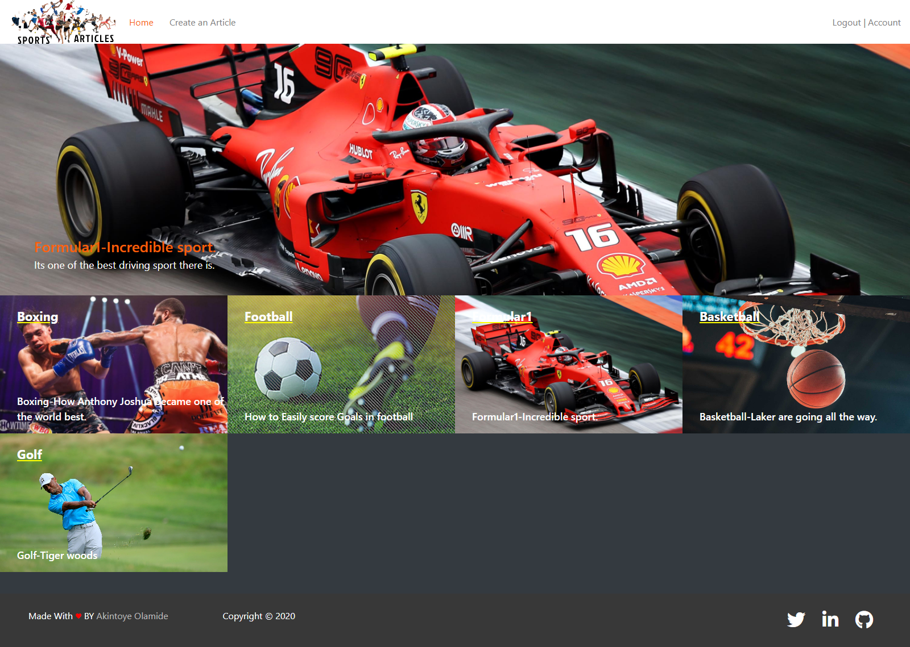

# Sports Article

> It is the rails capstone project and is compulsory to master the ruby on rails curriculum. This project is all about articles like a blog app.

## What it does

It's an app for articles.

_As a guest user:_

- You will be able to create account/log in.
- You will be able to see all articles of other users.
- You will not able to write your article.
- You will not able to give a vote to an article or comment on it.

_As a logged-in user:_

- You will be able to write, edit and delete your article.
- You will be able to vote for an article.

_As an Admin user:_

- You will be able to create, edit and delete any article.
- You will be able to create categories.

# Index Page ScreenShot

![screenshot]


## Built With

- Ruby 2.7.2
- Rails 6.1
- Google cloud Services for storage
- VS Code

## Demo

[Live link](https://desolate-coast-45080.herokuapp.com/)

## Video Walkthrough of the app

[Video Walkthrough](https://www.loom.com/share/da809776db30472085c5229ebff50376)

## Prerequisites

In order to make the program work, you need to have ruby interpreter installed in your system. You can get the latest version of ruby from [official website](https://www.ruby-lang.org/en/downloads/).

# Getting Started

To get a local copy of the repository please run the following commands on your terminal:

- you must have postgresql installed on your local machine.

```
$ cd sports-article
```

```bash
$ git clone https://github.com/AkintoyeOlamide/sports-article
$ cd sports-article
$ bundle install
$ yarn install --check-files
$ rails db:create
$ rake db:migrate
$ rails s
```

# Creating Categories on a new app

After migrating the database go to your terminal and type:

$ rails console or rails c
$ Category.create(name:'CategoryNameHere',importance:1)

App is designed to work with 4 category section so limit your categories to only 4

# Author

👤 **Akintoye Olamide**

- Github: [Akintoye Olamide](https://github.com/AkintoyeOlamide)
- Linkedin: [Akintoye Olamide](https://www.linkedin.com/in/akintoye-olamide-baa80b1a4/)

## Show your support

Give a :star:️ if you like this project!

## Acknowledgments

- <a href="https://guides.rubyonrails.org/" target="_blank">Rails Guides</a>
- Thanks for this Website Design [Nelson Sakwa
  ](https://www.behance.net/sakwadesignstudio).
